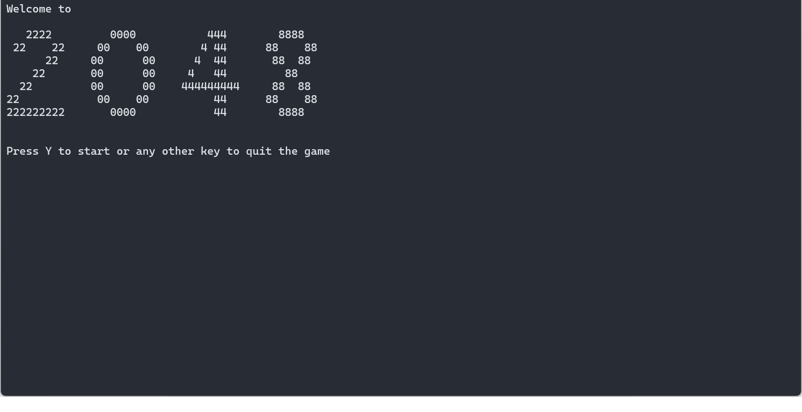
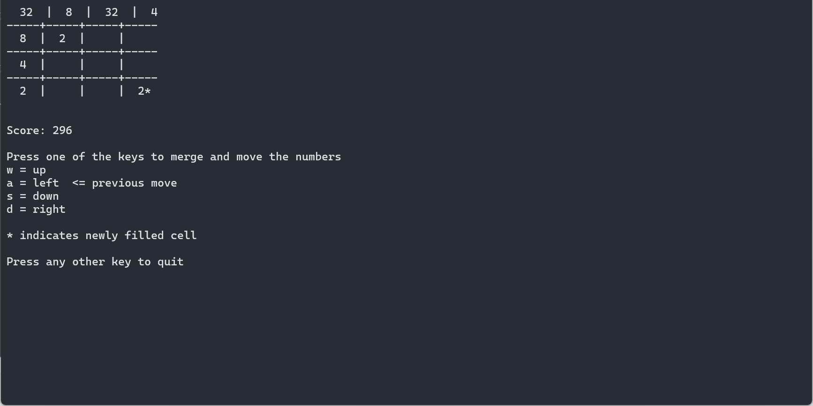

# Terminal 2048

This repository hosts a terminal-based adaptation of the renowned game 2048, coded in C++.

## Game Instructions

- Navigate the grid using the `w`, `a`, `s`, `d` keys to shift numbers up, left, down, and right respectively.
- The game interface showcases the 2048 grid alongside the numerical tiles.
- Your recent move and current score are displayed during gameplay.
- Instructions on gameplay is provided on-screen.

## Screenshots



## Build Instructions

### Prerequisites

- GCC/G++ compiler
- Ncurses library

### Building on Linux
1. Ensure GCC/G++ compiler is installed on your Linux distribution. The Ncurses library is typically available by default.
2. Navigate to the project directory in the terminal and execute the following command:
	```
	g++ 2048_Terminal.cpp -o 2048_Terminal
	```
3. Run the game by entering `./2048_Terminal`.

### Building on Windows 10 and 11

**STEP 1: Installing the C++ Compiler**
1. Install MSYS2 ([Website](https://www.msys2.org/)) *(Default installation settings recommended)*
2. Search for 'MSYS2 MSYS' in the start menu and launch the application (a terminal window will appear)
3. Execute `pacman -Syu` in the terminal window. The app may close temporarily for package updates. Reopen if needed.
4. Run `pacman -S base-devel` in the terminal window and proceed with installation by entering `y`.
5. Execute `pacman -S gcc cmake` and proceed with installation by entering `y`.
6. Verify successful installation by running `gcc --version` or `g++ --version`.

**STEP 2: Installing the Ncurses Library**

1. Launch 'MSYS2 MSYS' from the start menu (a terminal window will appear).
2. Execute `pacman -Syu` in the terminal window and proceed with installation by entering `y`.
3. Run `pacman -S mingw-w64-ucrt-x86_64-toolchain`.
4. Proceed with installation by pressing enter for default selection and entering `y`.
5. Execute `pacman -S mingw-w64-x86_64-ncurses` and proceed with installation by entering `y`.
6. Run `pacman -S mingw-w64-x86_64-pdcurses` and proceed with installation by entering `y`.
7. Close the terminal window upon completion.

- Ncurses library should now be installed.
- To compile the C++ code, open the 2048 directory in command prompt or PowerShell and execute:
	```
	g++ 2048_Terminal.cpp -o 2048_Terminal -lncurses -DNCURSES_STATIC
	```
- Run the game by double-clicking on the `2048_Terminal.exe` file.